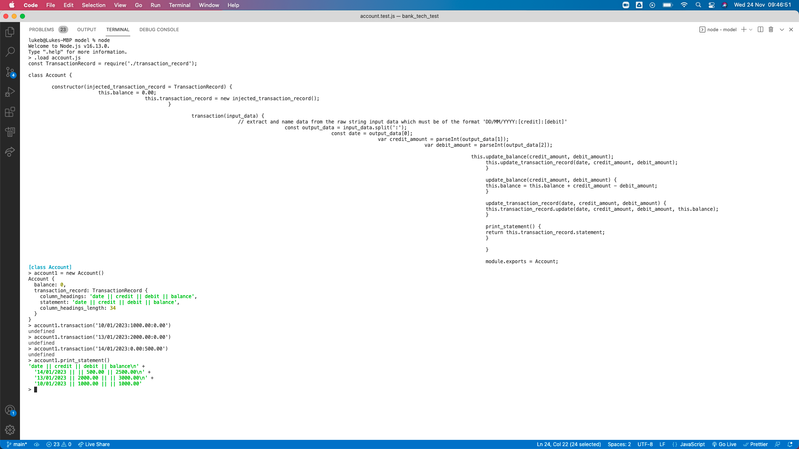

# Bank tech test

## Context 

See bank_tech_test.md for overview of the initial task

## Structure of code

- Functionality is provided by the account class.
- Accounts are created with 0 balance and a transaction record that contains only the column headings.
- Transaction information is passed as a string (see below) to the account class using .transaction.
- Internally, this string is parsed. Then, the balance and transaction record are updated.
- Transaction record can be printed using print_statement.
- The account class is dependent on the transaction_record class (see line 26 in account.js).
- I used dependency injection to allow for an injected_transaction_record (see lines 5 and 7 in account.js).
- In account.js, the injected_transaction_record is TransactionRecord.
- In account.test.js, the injected_transaction_record is TransactionRecordDummy.
- The functionality of TransactionRecordDummy is a copy of TransactionRecord currently. However, this still achieves test isolation, because future changes to ---- TransactionRecord will have no impact on TransactionRecordDummy and therefore no impact on accout.test.js.

## How to see

For an image of code being interacted with via repl, see:


For a video, see:
https://youtu.be/byBeK5XEKgM


## How to use

Below is how to interact with the code in a repl. It duplicates what the automated tests accomplish.

Open account.js in a javascript runtime environment such as node:
```
$ node
> .load [filepath for account.js]
```

Create a bank account:
```
> my_bank_account = new Account()
```

Add a transaction, in the format 'DD/MM/YYYY:[credit]:[debit]'. Credit and debit amounts must be to 2 decimal places:
```
> my_bank_account.transaction('10/01/2023:1000.00:0.00')
```

Print your bank statement:
```
> my_bank_account.print_statement()
```

## How to test

```
$ npm install jest
$ jest
```

